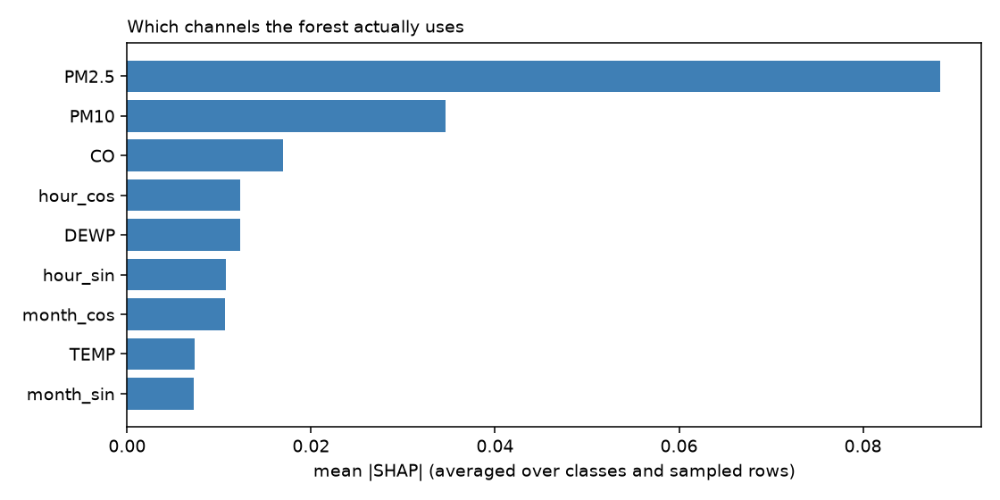

# SHAP examples — horizon 6 h

Attributions for `baseline_h6.pkl` (200 trees) via
`shap.TreeExplainer`, which is exact for tree ensembles — these are the model's actual
Shapley decomposition, not a sampled approximation.

**SHAP explains the model, not the atmosphere.** A large attribution on `PM2.5` means
the forest leaned on that channel for this prediction. It does not mean PM2.5 caused
the air quality, and the advisory copy must not imply it does.

In the plots, red pushes toward the predicted class and blue away from it. Hatched bars
are context channels (time of day, month, temperature, dew point) that a wearer cannot
act on — the distinction matters when the explanation becomes advice.

## Global channel importance

Mean |SHAP| over 200 randomly sampled test rows, averaged across classes.

| Channel | mean \|SHAP\| | Kind |
| --- | --- | --- |
| `PM2.5` | 0.0884 | actionable |
| `PM10` | 0.0347 | actionable |
| `CO` | 0.0169 | actionable |
| `hour_cos` | 0.0123 | context |
| `DEWP` | 0.0123 | context |
| `hour_sin` | 0.0108 | context |
| `month_cos` | 0.0107 | context |
| `TEMP` | 0.0073 | context |
| `month_sin` | 0.0072 | context |

## Cases

Chosen deliberately, not uniformly: a uniform sample of this test split is ~31%
*Unhealthy* and would rarely contain a Hazardous hour or a genuinely ambiguous set,
which are the cases an advisory has to get right.

| Plot | Why chosen | True | Predicted | Set size | Top-3 SHAP |
| --- | --- | --- | --- | --- | --- |
| [01_Hazardous_row19523.png](01_Hazardous_row19523.png) | Hazardous, confident (singleton set) | Hazardous | Hazardous | 1 | `PM2.5` +0.376, `PM10` +0.228, `CO` +0.068 |
| [02_Hazardous_row40389.png](02_Hazardous_row40389.png) | Hazardous, confident (singleton set) | Hazardous | Hazardous | 1 | `PM2.5` +0.369, `PM10` +0.222, `CO` +0.048 |
| [03_Hazardous_row45407.png](03_Hazardous_row45407.png) | Hazardous, ambiguous (set > 1) | Hazardous | Very unhealthy | 3 | `PM2.5` +0.186, `PM10` +0.064, `hour_cos` +0.040 |
| [04_Hazardous_row29121.png](04_Hazardous_row29121.png) | Hazardous, ambiguous (set > 1) | Hazardous | Hazardous | 2 | `PM2.5` +0.135, `PM10` +0.130, `hour_cos` +0.062 |
| [05_Very_unhealthy_row23850.png](05_Very_unhealthy_row23850.png) | Very unhealthy, ambiguous | Very unhealthy | Unhealthy | 3 | `PM2.5` +0.201, `PM10` +0.055, `DEWP` -0.048 |
| [06_Very_unhealthy_row3970.png](06_Very_unhealthy_row3970.png) | Very unhealthy, ambiguous | Very unhealthy | Very unhealthy | 2 | `PM2.5` +0.254, `PM10` +0.106, `CO` +0.031 |
| [07_highly_ambiguous_(set_ge_4)_row35504.png](07_highly_ambiguous_(set_ge_4)_row35504.png) | highly ambiguous (set >= 4) | Moderate | Moderate | 4 | `PM2.5` +0.166, `hour_sin` +0.059, `month_cos` -0.039 |
| [08_highly_ambiguous_(set_ge_4)_row35631.png](08_highly_ambiguous_(set_ge_4)_row35631.png) | highly ambiguous (set >= 4) | Unhealthy (sensitive) | Good | 4 | `PM2.5` +0.150, `CO` +0.078, `TEMP` +0.055 |
| [09_confident_row53737.png](09_confident_row53737.png) | confident, any class | Unhealthy | Unhealthy | 1 | `PM2.5` +0.219, `PM10` +0.086, `CO` +0.029 |
| [10_confident_row4720.png](10_confident_row4720.png) | confident, any class | Unhealthy | Unhealthy | 1 | `PM2.5` +0.238, `PM10` +0.075, `month_sin` +0.044 |
| [11_random_row45393.png](11_random_row45393.png) | random | Hazardous | Hazardous | 2 | `PM2.5` +0.187, `PM10` +0.096, `hour_cos` +0.057 |
| [12_random_row20808.png](12_random_row20808.png) | random | Unhealthy | Moderate | 4 | `PM2.5` +0.119, `hour_cos` +0.048, `month_cos` -0.032 |

Regenerate with `python -m src.explainability.shap_analysis`.
